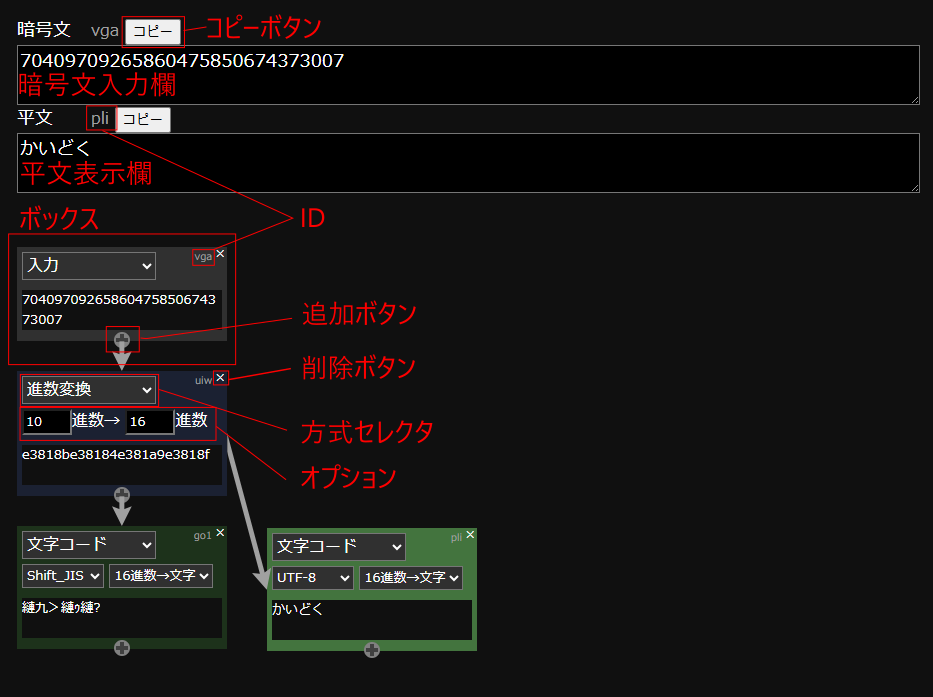

# 解読ツール
### 注意
未実装やバグが残っています

### 使い方

1. 方式セレクタが「入力」になっているボックスをクリックし、暗号文入力欄の上のIDが更新されていることを確認する
2. 暗号文入力欄に暗号文を入力する
3. 追加ボタンを押し、ボックスを追加する
4. 新規作成したボックスの方式セレクタを解読したい暗号方式に変更する
5. オプション内を埋める
6. 結果を表示させたいボックスをクリックすると平文表示欄に解読結果が表示される

### ボックス
* 入力  ...黒
* <span style="color: green; ">符号</span>
  * 文字コード
    * ShiftJIS
    * US-ASCII
    * EUC-JP
    * UTF-8
    * UTF-16
    * base64
  * モールス
    * 和文モールス
    * 欧文モールス
  * 点字
  * 2タッチ(ポケベル)
  * base64
* <span style="color: red; ">古典暗号（文字置換）</span>
  * シーザー
  * みかか
  * 文字置換
    * オプション内を```,```区切りで入力することで複数文字を同時に置換可能
  * アトバシュ
  * ビジュネル
  * 上杉
  * ポリュビオス
* <span style="color: yellow; ">古典暗号（位置交換）</span>
  * 逆順
  * スキュタレー
  * レールフェンス
  * 文字追加
* <span style="color: blue; ">数学</span>
  * 進数変換
  * 計算
    * 数字と```+-*/%()a```を含めた計算が可能

### Thanks
* 文字コード変換： encoding.js by polygonplanet<br>
https://github.com/polygonplanet/encoding.js/blob/master/README_ja.md
* 矢印：　leader-line by anseki<br>
https://github.com/anseki/leader-line